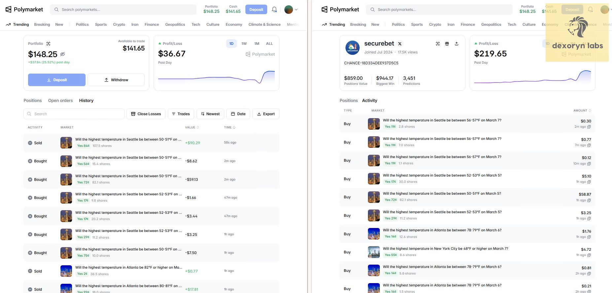
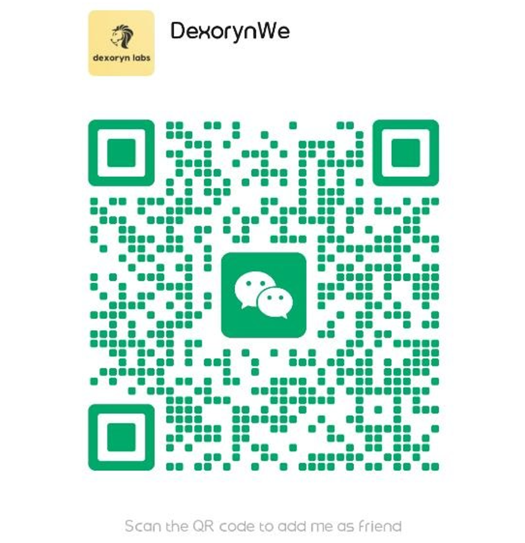

# Polymarket Bot | Polymarket Trading Bot | Polymarket Copy Trading Bot  

**Languages:** [English](README.md) · [中文](public/README.zh-CN.md) · [Русский](public/README.ru.md)

> **Automated Polymarket copy trading bot that mirrors active traders in real time**  
> **Predictions & Perps • Multi-wallet • Web dashboard • Live tested • Real on-chain execution**

> **Need help or an updated build?**  
> 📱 **Telegram**: [t.me/dexoryn](https://t.me/dexoryn) | 🎮 **Discord**: `dexoryn_`

---

## 🎥 Live Profit Videos (Historical - Gabagool22)

These sessions were recorded while **@gabagool22** was actively trading. They show the bot executing real copy trades on-chain-not a simulation.

**Wallet (historical target):** `0x6031b6eed1c97e853c6e0f03ad3ce3529351f96d`

> **Note:** Gabagool22 is no longer a reliable copy target. The videos remain proof that the bot worked in production; add **active wallets** as targets in the dashboard (or `targets.yaml`). See [Story 3](#story-3--bot-still-running-after-gabagool22-stopped) below.

### Video 1 - Live Copy Trading Run

https://github.com/user-attachments/assets/2194ef92-b0f7-40e1-9835-4d2965e85e81

- **+$80 profit in ~15 minutes**
- Bot ran unattended during this session
- Real on-chain execution, not simulation

### Video 2 - Second run (confirmation)

https://github.com/user-attachments/assets/df3a6791-89b5-4230-ae40-fb7130dcadc4

- **Additional +$230 profit in the next ~15 minutes**
- Same bot, same logic, separate run
- Fully automated copy trading

---

## 📖 Live Test Stories (Real Usage)

### Story 1 - Unattended session (Gabagool22 era)

After updating the bot, I ran it to test the new logic and left it running while I went out to play billiards with friends.

About one hour later, when I returned:

- ✅ The bot was running normally
- ✅ It was copy trading accurately
- ✅ Trades matched the target trader's transactions
- ✅ The bot had already generated profit

This was a fully unattended live run, not a simulation or backtest.

---

### Story 2 - Repeatable performance (video runs)

The two videos above are from **separate live sessions** on different days. Same codebase, same monitoring and execution pipeline-no manual clicking through Polymarket. That repeatability is what we optimize for: stable automation, not a one-off lucky trade.

---

### Story 3 - Bot still running after Gabagool22 stopped

<a id="story-3--bot-still-running-after-gabagool22-stopped"></a>

Gabagool22 eventually **slowed down and stopped being a practical copy target**-fewer trades, different behavior, or simply going inactive. A lot of copy traders hit the same wall: the wallet that worked last month goes quiet, and their bot looks "broken" when the real issue is an **empty signal**, not broken software.

What we did:

- Kept the **same bot** running-no rewrite, no new product
- Added **new active wallets** as targets in the dashboard (saved to `targets.yaml`)
- Confirmed the full pipeline still works: trade detection → sizing → order posting → logging

What we saw:

- ✅ Process stayed up and healthy
- ✅ New target trades were detected and mirrored correctly
- ✅ Activity history and `state.json` updated as expected
- ✅ Failures were isolated to market/order edge cases, not "bot died when Gabagool22 left"

#### Perfect copy-trading result - mirroring **securebet**

After switching targets, we copied [**securebet**](https://polymarket.com/@securebet) and captured this side-by-side:

<p align="center">
  
</p>

**This is what ideal copy trading looks like.** Your bot wallet (left) and the target trader (right) show the **same PnL chart shape** for the day-the same flat period, dip, and recovery spike at the end. Dollar amounts differ because of your sizing settings and balance, but the **curve tracks the leader**, which means trades are being detected and mirrored in sync-not lagging behind or fighting the strategy.

Same session, same markets in the activity/history tabs (e.g. the temperature markets visible in the screenshot). That alignment is the proof traders care about: **follow the wallet, get the same equity curve pattern.**

**Takeaway for traders:** This bot is built to follow **whoever you configure**, not one celebrity wallet. When a trader stops working for you, **change the target-not the bot.** Past Gabagool22 results do not guarantee future results on any target.

---

## 🆕 What's new in this build

This repo is a **production-grade copy bot**, not a single-wallet script:

- **Multi-wallet copy** - add, enable, or pause several targets; each with its own sizing and exposure cap
- **Lower-latency path** - WebSocket detection, bounded fill queue, and CLOB connection keep-warm between orders
- **Web dashboard** - manage targets, watch activity, review positions, and tune settings in the browser
- **Polymarket Perps** - copy perpetuals portfolios from leader accounts (separate venue from prediction markets)
- **Exit mirroring** - optional proportional SELL / close copying (`copy_closes`)
- **Telegram alerts** - optional notifications for copy success, failures, and errors

The videos above are from the **predictions** pipeline. Perps and the dashboard are newer-start in `dry_run`, confirm activity in the UI, then switch to `real` when you are ready.

---

## ⭐ Why This Bot

### 🎯 Real proof, not just claims

Other Polymarket bots often stop at screenshots. This repo includes **video proof** of live execution plus the stories above-including running correctly **after** the original star trader went inactive.

### 🚀 Architecture & performance

- **WebSocket activity feed** - subscribes to Polymarket's live trade stream for fast detection
- **Non-blocking pipeline** - bounded fill queue so order posting never stalls the WS loop
- **CLOB keep-warm** - pooled HTTP connections stay hot between copy orders
- **Per-target portfolios** - independent sizing, dedup, and exposure tracking per wallet
- **SQLite history** - `history.db` powers the activity feed and post-trade review
- **Settings override** - dashboard edits persist to `settings.yaml` without restart

### 💡 Features traders actually use

- **Multi-target management** - several prediction or perps leaders at once (predictions venue)
- **Web dashboard** - overview, targets, activity, positions, and settings at `http://127.0.0.1:8787`
- **Predictions + Perps** - switch copy venue from the dashboard (one active venue at a time)
- **Copy closes** - mirror target exits, not just entries
- **Share batching** - accumulate small fills before posting (helps minimums and gas)
- **Fixed or percent sizing** - per target, in USD or as a fraction of the leader's chunk
- **Dry-run mode** - `mode: dry_run` in `config.yaml` logs intent without posting
- **Taker or maker orders** - FAK taker with slippage cap, or GTC maker with tick offset
- **Telegram notifications** - optional push on copy events and errors
- **Silent-connection watchdog** - reconnects or exits on zombie WS for clean restarts

### 📈 Comparison

| Feature | This Bot | Typical alternatives |
|---------|----------|----------------------|
| **Live execution proof** | ✅ Videos + real stories | ❌ Claims only |
| **Multi-wallet copy** | ✅ Per-target caps | ❌ Single address |
| **Web dashboard** | ✅ Built-in | ❌ CLI / `.env` only |
| **Perps copy** | ✅ | ❌ Predictions only |
| **Exit mirroring** | ✅ Optional | ❌ Entry only |
| **Latency visibility** | ✅ Dashboard chart | ❌ |
| **Survives target going inactive** | ✅ Swap targets in UI | ⚠️ Tied to one influencer |
| **WebSocket detection** | ✅ | ⚠️ Polling only |
| **Dry-run mode** | ✅ | ❌ |
| **Share batching** | ✅ | ❌ |
| **Persistent state** | ✅ `state.json` + history DB | ⚠️ Limited |

---

## 🎯 Who This Is For

**Good fit:**

- Traders who want **passive exposure** to wallets they trust
- Users who prefer a **dashboard** over editing YAML for every target change
- People copying **multiple leaders** or rotating targets when activity drops
- Users comfortable running **Python 3.10+** and a local bot process
- People who understand **on-chain risk**, gas, and that leaders change over time

**Not a fit:**

- Anyone expecting **guaranteed** profits or a forever hands-off money printer
- Users who need **predictions and perps copying at the same time** (one venue is active while copying)
- Anyone exposing the dashboard to the internet **without** setting `web.token`
- Complete beginners who will not monitor logs or the activity feed

---

**Jump to:** [Quick Start](#-quick-start) · [Dashboard](#-dashboard) · [Perps](#-perps-copy-trading) · [Configuration](#configuration) · [Contributing](#contributing)

## 🚀 Quick Start

### Prerequisites

- **Python 3.10+**
- **Node.js 18+** (only if you build the dashboard UI yourself)
- **Polygon wallet** - USDC for prediction markets, POL/MATIC for gas (when `mode: real`)
- **Polymarket CLOB API credentials** - required for live prediction-market orders
- **Funded Perps account** - required only when copying Polymarket Perps in `real` mode

## Installation

```bash
git clone https://github.com/dexorynlabs/polymarket-trading-bot-python.git
cd polymarket-trading-bot-python

pip install -r requirements.txt

cp config.yaml.example config.yaml
# Edit config.yaml - mode, web settings, polymarket secrets (real mode)

python -m app.main
```

### First run (recommended)

1. Keep **`mode: dry_run`** until you see target fills in the dashboard **Activity** tab
2. Open **http://127.0.0.1:8787** (default `web.host` / `web.port`)
3. Add targets under **Targets** - wallet address, venue (`predictions` or `perps`), sizing
4. Press **Start** on the venue you want to copy
5. When behavior looks correct, set **`mode: real`**, restart, and start again with small size

Build the UI from source (optional; production builds output to `app/web/static/`):

```bash
cd ui
npm install
npm run build
```

See [`ui/README.md`](ui/README.md) for `dev`, `dev:mock`, and auth notes.

**Help:** [@dexoryn](https://t.me/dexoryn) on Telegram.

---

## 🖥 Dashboard

The built-in dashboard is the primary way to operate the bot after the first `config.yaml` setup.

| Page | What you do there |
|------|-------------------|
| **Overview** | Copy status, active venue, latency snapshot |
| **Targets** | Add, edit, enable, or pause leader wallets |
| **Activity** | Live feed of detected fills and copy results |
| **Positions** | Open exposure and headroom |
| **Settings** | Sizing, slippage, notifications; saved to `settings.yaml` |

Default URL: **http://127.0.0.1:8787**

> Keep `web.host: 127.0.0.1` unless you set `web.token`. Do not expose the dashboard publicly without authentication.

If the UI prompts for a token, set `web.token` in `config.yaml` and enter the same value in Settings.

---

## 📈 Perps copy trading

Copy **Polymarket Perps** positions from a target account:

- Portfolio changes are detected by polling the target's public Perps profile
- Orders are IOC limits at mark ± configured slippage
- Configure targets with `venue: perps` in the dashboard or `targets.yaml`
- **`copy.venue: perps`** selects the Perps pipeline when you press Start
- Delegated signing session is stored in `perps_session.json` (gitignored)
- Fund your Perps account on [polymarket.com](https://polymarket.com) before live copying

**One venue at a time:** while copying, either **predictions** or **perps** runs-not both simultaneously. Switch venue from the dashboard when you want to change markets.

---

## Configuration

Bootstrap secrets and global mode in **`config.yaml`**. Targets and most tuning live in the **dashboard** (persisted to `targets.yaml` and `settings.yaml`).

Start with `mode: dry_run`. Dashboard changes to trading settings override matching keys in `config.yaml`.

### Essential `config.yaml` settings

| Setting | Description | Example |
|---------|-------------|---------|
| `mode` | `dry_run` logs/simulates; `real` posts orders | `dry_run` |
| `copy.venue` | Initial venue when copying starts | `predictions` |
| `web.enabled` | Serve the dashboard | `true` |
| `web.host` / `web.port` | Bind address | `127.0.0.1` / `8787` |
| `web.token` | Optional API/dashboard auth | `""` |
| `risk.max_open_usd_total` | Optional cap across all prediction targets | `null` |
| `execution.order_type` | `taker` (FAK) or `maker` (GTC) | `taker` |
| `slippage.entry_bps_max` | Max slippage on BUY copies (bps) | `1000` |
| `perps.poll_interval_s` | Perps portfolio poll period | `1.0` |
| `telegram.enabled` | Push alerts to Telegram | `false` |

For `mode: real`, fill the `polymarket:` section with `private_key`, `wallet_address`, `api_key`, `api_secret`, and `passphrase`. See **`config.yaml.example`** for maker settings, order minimums, dedup, watchdog, and signature types.

### Targets (`targets.yaml` / dashboard)

On first run, targets from `config.yaml` seed `targets.yaml`. After that, manage targets in the **Targets** page.

| Field | Description |
|-------|-------------|
| `name` | Label shown in the dashboard |
| `venue` | `predictions` (CLOB) or `perps` |
| `wallet` | Leader's proxy wallet (predictions) or account address (perps) |
| `enabled` | Pause without deleting |
| `copy_closes` | Mirror target SELLs / reductions |
| `sizing.mode` | `fixed` or `percent_of_target` (predictions); `percent_of_target` or `fixed_notional` (perps) |
| `sizing.max_open_usd` / `max_open_notional_usd` | Per-target exposure cap |

Legacy configs with a single `target_wallet` and top-level `sizing:` are **auto-migrated** to one target on first launch.

### Pick traders to copy

Verify activity and risk on [polymarket.com](https://polymarket.com) before enabling a target. Rotate leaders when their activity drops-Gabagool22 is a lesson, not a permanent setting.

---

## Safety & Risk Management

⚠️ **This bot places real trades with real funds when `mode: real`.**

- Start with `mode: dry_run` and confirm fills appear in **Activity**
- **Rotate targets** when a trader goes quiet
- Set conservative per-target caps and optional `risk.max_open_usd_total`
- Check `logs/copybot.log` and the dashboard **Activity** tab regularly
- Past performance (including the videos) **does not** guarantee future results

1. Use a dedicated wallet with limited balance  
2. Never commit `config.yaml`, `targets.yaml`, or `settings.yaml` with live secrets  
3. Set `web.token` if the dashboard is reachable outside localhost  
4. Know how to stop the bot (`Ctrl+C`) and pause copying from the dashboard  
5. Research wallets before adding them as targets  

---

## FAQ

**Can I copy multiple wallets at once?**  
Yes on the **predictions** venue-multiple enabled targets copy in parallel, each with its own sizing cap. Perps supports multiple configured targets; only one **venue** (predictions or perps) copies at a time.

**Can I copy predictions and perps simultaneously?**  
No. Switch venue in the dashboard. This keeps margin and risk logic clean.

**Can I still copy Gabagool22?**  
You can add any address, but Gabagool22 is **not recommended** anymore-activity dropped. Use **currently active** traders instead.

**What if my target stops trading?**  
The bot keeps running; you will not see new copies until you enable an active target. That is expected, not a failure.

**Do I still need `config.yaml` if I use the dashboard?**  
Yes for `mode`, API secrets, and web/Telegram settings. Day-to-day target edits live in the dashboard / `targets.yaml`.

**Where are logs and history stored?**  
`logs/copybot.log`, `history.db`, `state.json`, and `settings.yaml` (all gitignored except the example config).

**Does this work on all Polymarket markets?**  
Standard markets are supported; illiquid or edge cases may fail individually and get logged.

**Is this open source?**  
Yes. A maintained premium build with extra support is also available via Telegram.

---

## Author & Contact

**Dexoryn Labs** - Polymarket copy-trading automation

- **Telegram**: [@dexoryn](https://t.me/dexoryn) (fastest)
- **Discord**: `dexoryn_`
- **Twitter**: [@dexoryn](https://x.com/dexoryn)
- **GitHub**: [@dexorynLabs](https://github.com/dexorynLabs)
- **WeChat**: scan to add **DexorynWe**

<p align="center">
  
  &nbsp;&nbsp;
  
</p>

---

## Contributing

1. Fork the repo  
2. `git checkout -b feature/your-feature`  
3. Commit and push  
4. Open a Pull Request  

Dev dependencies: `pip install -r requirements-dev.txt` then `pytest`.

---

## Legal Disclaimer

Trading on Polymarket involves **substantial risk of loss**. Dexoryn is not responsible for losses from using this software. You are solely responsible for wallet security, target selection, and capital at risk.

**Only trade with funds you can afford to lose.**

---

If this project helps you, consider ⭐ starring the repo or opening issues/PRs. Questions: [@dexoryn](https://t.me/dexoryn).
